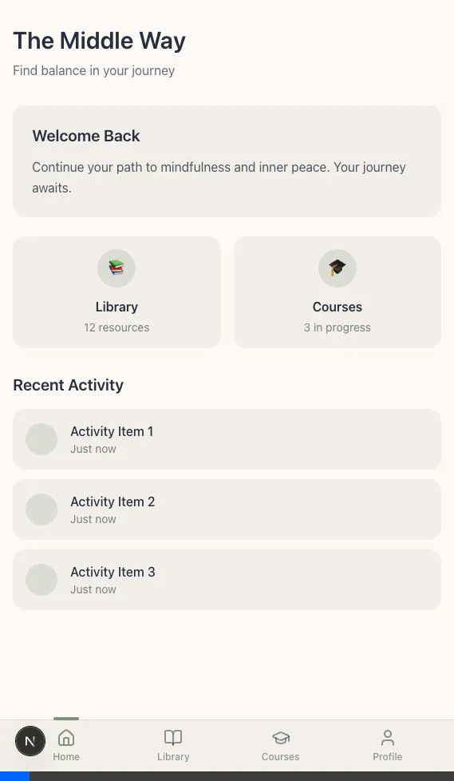

# Issue #3: Walkthrough ✅

Setup โปรเจค Next.js 14+ พร้อม TypeScript สำหรับแอป "The Middle Way" เรียบร้อยแล้ว!

---

## สิ่งที่สร้างเสร็จแล้ว

### 1. Core Configuration
- **Next.js 16.1.6** (App Router) + TypeScript
- **Tailwind CSS** v4 พร้อม PostCSS
- **Framer Motion** สำหรับ animations
- **Lucide React** สำหรับ icons

### 2. Design System (Warm Modern Sanctuary)

| Token | Color | Usage |
|-------|-------|-------|
| `ivory` | `#FCF9F6` | Background |
| `sage` | `#8B9D83` | Primary Accent |
| `slate` | `#2D3748` | Text |
| `sand` | `#F3F0ED` | Surface/Cards |

**Typography:**
- **Headings**: Playfair Display (Serif)
- **Body**: Inter (Sans-serif)

**Custom Radius:**
- `rounded-pill` (40px) - สำหรับ buttons
- `rounded-card` (1rem) - สำหรับ cards

### 3. Folder Structure

```
/app
  ├── page.tsx (Dashboard)
  ├── layout.tsx (Root Layout + Navigation)
  ├── globals.css (Design Tokens)
  ├── /library
  ├── /courses
  └── /profile
/components
  ├── /ui (Atomic components - empty)
  └── /layout
      └── MobileNavigation.tsx
/lib (Utilities - empty)
/hooks (Custom hooks - empty)
```

### 4. Initial Shell



**Mobile Navigation Bar** (fixed bottom):
- 🏠 Home - Dashboard
- 📚 Library - Resources collection
- 🎓 Courses - Learning progress
- 👤 Profile - User settings

---

## Verification

```bash
# Build สำเร็จ
✓ Compiled successfully
✓ TypeScript check passed
✓ Static pages generated: /, /library, /courses, /profile
```

---

## วิธีรัน

```bash
cd "/Users/oatrice/Software-projects/The Middle Way"
npm run dev
```

เปิด browser ไปที่ **http://localhost:3000**

---

## ไฟล์หลัก

| File | Description |
|------|-------------|
| `app/layout.tsx` | Root layout + fonts + navigation |
| `app/globals.css` | Design system tokens |
| `components/layout/MobileNavigation.tsx` | Bottom navigation component |
| `app/page.tsx` | Dashboard placeholder |
